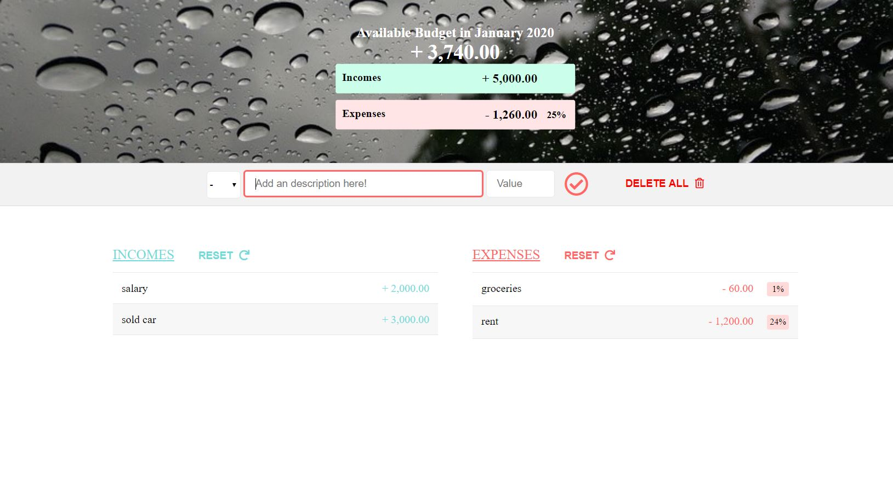

## Budgety 

Budgety takes as input your incomes and expenses, calculates the differences and  prints out the total budget available in a reference month.

it offers you the to possibility to find out the total incomes and expenses from a month, and also to delete one entry or to delete them all.

